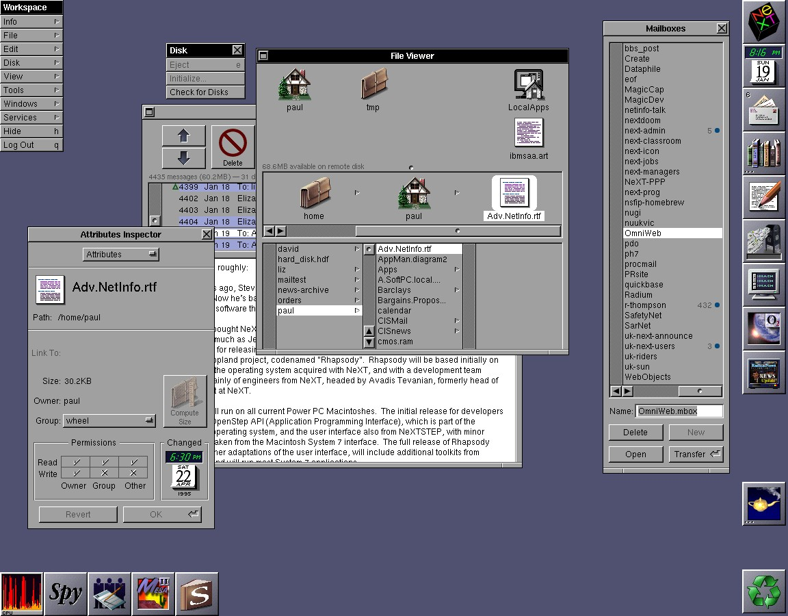
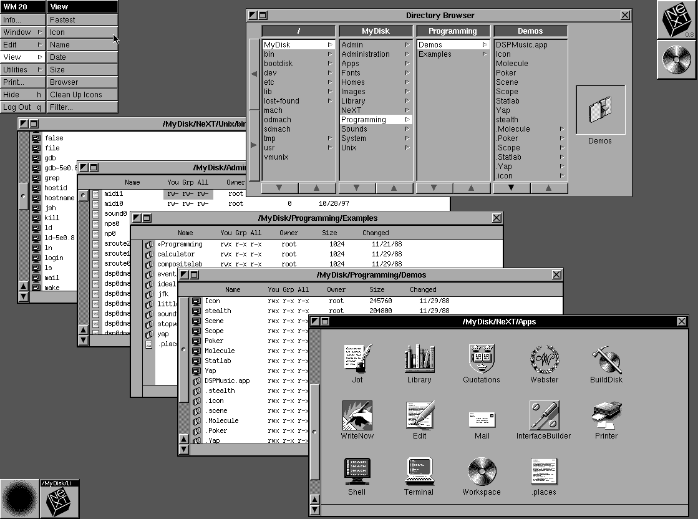
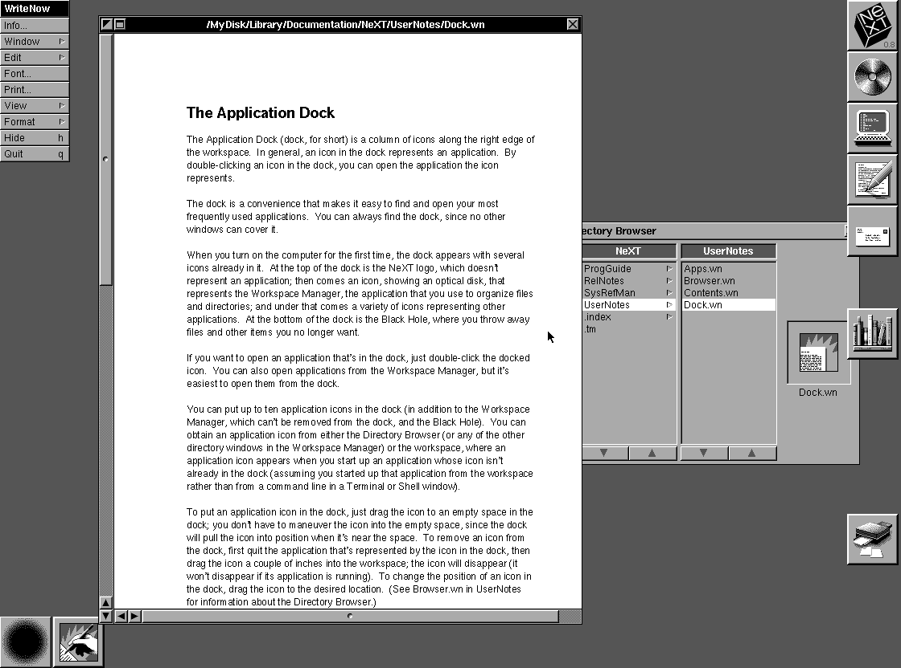
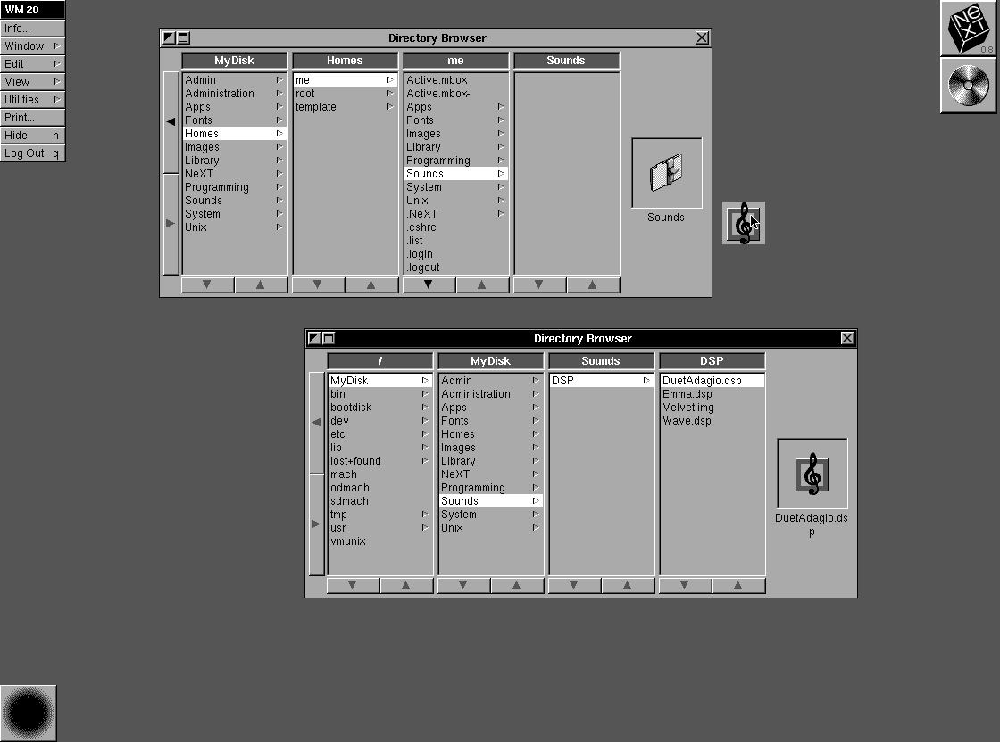
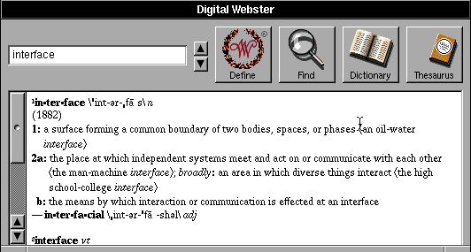

## 概述

NeXTSTEP（1988–1997）是乔布斯离开苹果后创办 NeXT 公司开发的操作系统，其 UI/UX 设计深刻影响了 macOS、iOS 乃至整个现代 GUI 设计。技术遗产以 **NS 前缀**（NeXTSTEP → NSString/NSArray/NSView）活在所有 Cocoa/UIKit 框架中。

## 标志性视觉元素

| 元素 | 描述 | 现代遗产 |
|------|------|----------|
| **50% 灰背景** | 大面积 #808080 灰色 + 浅灰窗口，克制不花哨 | macOS 直到 Big Sur 前的 WindowServer 质感 |
| **粗像素边框** | 窗口/按钮用 2px 实线边框，无圆角/渐变/玻璃 | 奠定了工具性 UI 的审美基调 |
| **投影菜单** | 下拉菜单带阴影拉开层级 | 所有现代 OS 菜单标配 |
| **交通灯按钮** | 红/黄/绿圆点（NeXT 首创） | macOS 继承（颜色布局变了但位置保留） |
| **Dock** | 48×48 纯图标无文字标签，支持左/下/右位置，放大动画 | macOS Dock 核心交互，iOS 亦受此影响 |

## 窗口系统

- **多窗口平铺**（非堆叠）—— 窗口默认并排，强调 workspace 概念
- **Workspace Manager** — 文件管理 + 应用启动合一的桌面环境
- **置顶/置底 Pin 按钮** — 每个窗口左上的"钉"按钮，类似现代 "Stay on Top"

## 交互哲学

> "Just enough to get the job done, nothing more."

- **统一拖放** — 系统级支持，从文件管理器拖到任意应用窗口即可打开
- **Interface Builder**（1988 年）— 可视化搭建 UI，拖拽控件连线到代码逻辑
- **级联 Edit 菜单** — 所有应用共享剪贴板/撤销/拼写检查，无需各自实现
- **Preferences 应用化** — 每个应用自带 Preferences... 菜单
- **键盘导航** — Tab 跳焦点、Cmd+? 快捷键无处不在

## 字体与渲染

- 默认字体 **Helvetica**
- 屏幕 **1120×832 @ 92 DPI**
- **Display PostScript** — 用 PostScript 做屏幕渲染，屏幕显示 = 打印机输出 = 所见即所得（超前时代 20 年）

## 设计哲学

| 原则 | 表现 |
|------|------|
| 减法是成熟 | 没有多到让人焦虑的选项，没有装饰性元素 |
| 功能决定形式 | 不为"让界面看起来现代"而加东西 |
| 一致性优先 | 所有应用共享 Application Kit 渲染引擎 |
| 围绕内容组织 | 窗口不是工具条的附属品 |

## 现代影响

NeXTSTEP → **macOS** → **iOS** 这条线几乎没断过：
- Dock（左/下/右均可、放大动画、隐藏）
- 交通灯按钮（颜色变但位置不变）
- **NS 前缀**（整个 Cocoa/UIKit 框架的 NS = NeXTSTEP）
- Interface Builder → Xcode Interface Builder
- Display PostScript → Quartz 2D → Core Graphics
- 1996 年苹果收购 NeXT → 以 OPENSTEP 为基础构建 Mac OS X

## 引用来源

- Wikipedia: NeXTSTEP — https://en.wikipedia.org/wiki/NeXTSTEP
- The story of NeXTSTEP (Pieter Herman) — https://blog.pieterherman.dev/the-story-of-nextstep-29449fcbd834
- Tech Time Warp: NeXTSTEP paved the way for OS X and iOS — https://smartermsp.com/tech-time-warp-nextstep-introduced-paving-the-way-for-os-x-and-ios
- DESIGNING THE TEXTSTEP USER INTERFACE — https://nielssp.dk/2020/07/textstep
- Mac 视觉史（三）：浴「水」重生的 Mac 视觉美学 - 少数派（wiki/sources/ 中已有收录）

## 实图截图

> 截图来源：Wikipedia / ToastyTech GUI Gallery / System Folder Blog
> 存放位置：`nextstep-screenshots/` 目录下

### 图1：NeXTSTEP 完整桌面（1152×900）

右侧竖排 Dock，多个浮动窗口，Miller Columns 文件浏览器。注意标题栏的条纹质感和窗口的3D边框。

### 图2：Miller Columns 文件浏览器

多层级目录同时展开，点一列的文件夹，右侧展开下一列。Finder 的分栏视图就是从这里来的。

### 图3：右侧 Dock 应用栏

Dock 在屏幕右侧竖排（不是 macOS 的底部横排），每个运行中的应用一个图标。

### 图4：拖拽操作

把文件从一个目录拖到另一个目录，或拖到 Dock 上的应用图标来打开。

### 图5：Digital Webster 字典应用

标题栏条纹、凸起按钮、凹陷输入框——NeXTSTEP 应用的典型界面。